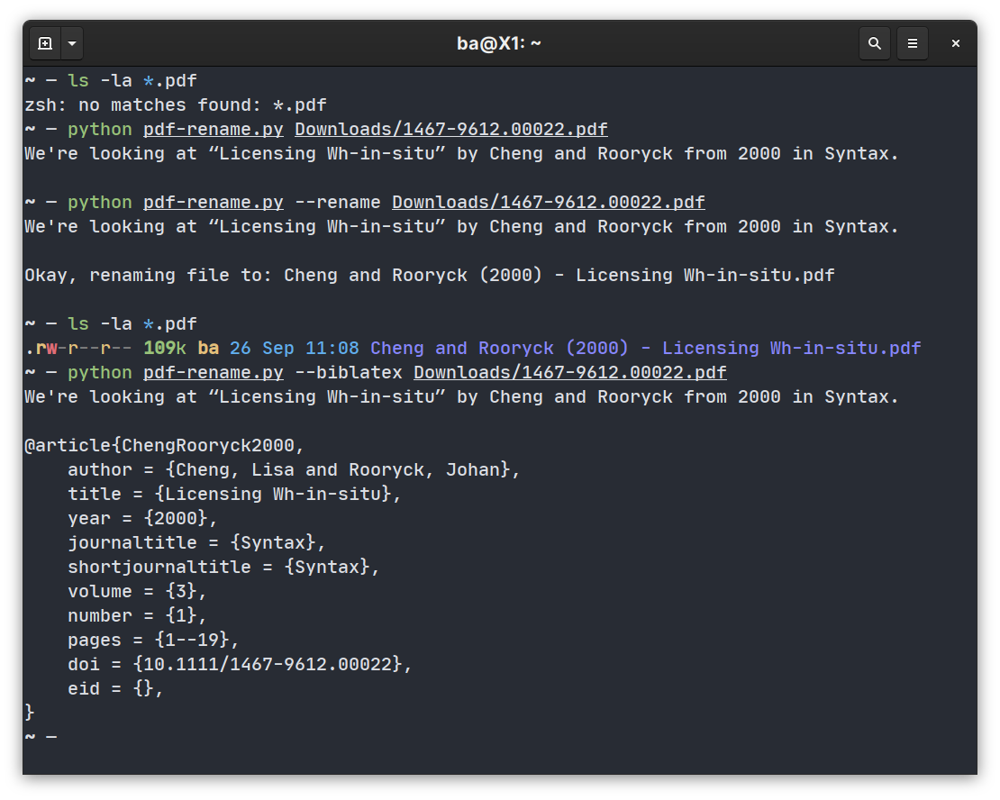

# A PDF renamer for linguistics

This python script renames PDFs from a few linguistics journals (so far
*Glossa*, *Natural Language & Linguistic Theory*, *Syntax*, and *Linguistic
Inquiry*) based on information gathered from the PDF's metadata and the
document's first page.

Papers from *Glossa*, *Natural Language & Linguistic Theory*, and *Syntax* are
recognised automatically. To rename a paper from *LI*, add the `--li` option.
I might add others in the future.

In addition to renaming files, the script can also output a `biblatex` entry
for the file.

The format of the renamed files is `Author [and Author] (Year) - Title.pdf`; it
does not handle more than two authors consistently (yet?). The bibliography
entry is using `biblatex` fields (e.g. `journaltitle`) but can be adapted
easily. The script also recognises subtitles when introduced by ‘:’.

Finally, the script does not actually rename the file — it creates a copy. This
was safer to play around with.

## Help

```
> python pdf-rename.py --help
usage: pdf-rename.py [-h] [--rename] [--biblatex] [--li] filename

Rename PDFs automatically to include author, year, and title.

positional arguments:
  filename    PDF to rename

  optional arguments:
    -h, --help  show this help message and exit
    --rename    rename PDF file
    --biblatex  create biblatex entry
    --li        rename a PDF from Linguistic Inquiry
```

## Examples


